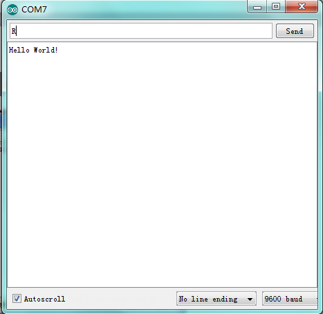

# Project 1: Hello World

## はじめに

まずは、シンプルなことから始めましょう。このプロジェクトでは、ArduinoとUSBケーブルだけで「Hello World！」実験を始めることができます。これは、ArduinoとPCの通信テストであるだけでなく、Arduinoの世界に初めて挑戦するための入門プロジェクトでもあります！

## 必要なハードウェア

- V4.0ボードまたはMEGA 2560ボード *1
- USBケーブル *1

## サンプルコード

Arduinoのドライバをインストールした後、Arduinoソフトウェアを開き、Arduinoが「Hello World！」を表示するコードをコンパイルします。もちろん、Arduinoが指示なしで「Hello World！」を連続して表示するコードをコンパイルすることもできます。シンプルなif文を使用して指示を行うことができます。ピン13に接続されたオンボードLEDを使用して、Arduinoが指示を受け取ったときに最初にLEDを点滅させ、その後「Hello World！」を表示するように指示することができます。

```cpp
int val; // 変数valを定義
int ledpin = 13; // デジタルインターフェース13を定義

void setup() {
  Serial.begin(9600); // ボーレートを9600に設定してソフトウェアの設定と一致させる。特定のデバイス（例：Bluetooth）に接続する場合、ボーレートはそのデバイスと一致させる必要がある。
  pinMode(ledpin, OUTPUT); // デジタルピン13を出力として初期化。ArduinoでI/Oポートを使用する場合、このような設定が常に必要。
}

void loop() {
  val = Serial.read(); // PCからArduinoへの指示や文字を読み取り、それをValに代入する。
  if (val == 'R') { // 受け取った指示や文字が「R」であるかを判定。
    digitalWrite(ledpin, HIGH); // デジタルピン13のLEDをオンにする。
    delay(500);
    digitalWrite(ledpin, LOW); // デジタルピン13のLEDをオフにする。
    delay(500);
    Serial.println("Hello World!"); // 「Hello World！」の文字列を表示。
  }
}
```

## テスト結果

シリアルモニタをクリックし、「R」と入力すると、LED 13が一度点滅し、PCがArduinoからの情報「Hello World」を受信します。



## 実験手順

適切なポートを選択した後、この実験は非常に簡単です！

1. ArduinoボードをUSBケーブルでPCに接続します。
2. Arduino IDEを開き、適切なボードとポートを選択します。
3. 上記のサンプルコードをArduino IDEにコピーし、アップロードします。
4. シリアルモニタを開き、ボーレートを9600に設定します。
5. シリアルモニタに「R」と入力し、送信します。
6. LED 13が点滅し、シリアルモニタに「Hello World！」と表示されることを確認します。
