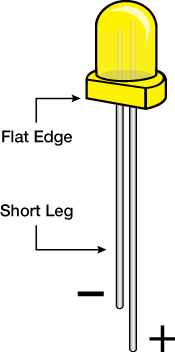
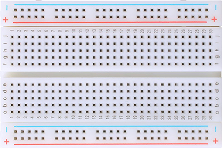
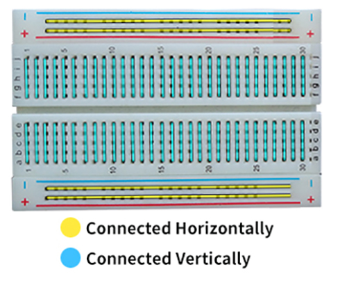
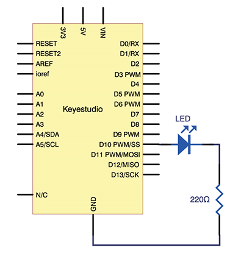
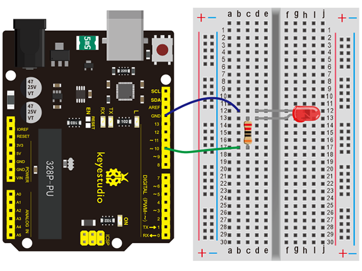
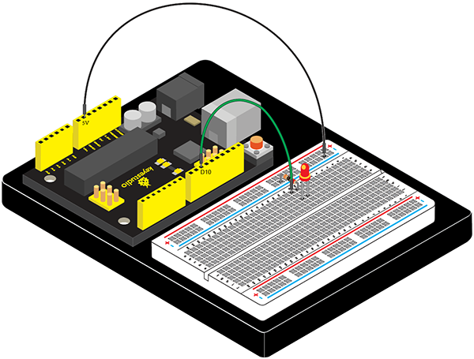

# Project 2: LED点滅

## はじめに

LED点滅実験は非常にシンプルです。以前の「Hello World！」プログラムではLEDを使用しました。

今回は、基板にはんだ付けされたLED13ではなく、LEDをデジタルピンに接続します。ArduinoとUSBケーブルに加えて、以下の部品が必要です：

## 必要なハードウェア

- V4.0ボードまたはMEGA 2650ボード *1
- USBケーブル *1
- 赤色M5 LED *1
- 220Ω 抵抗 *1
- ブレッドボード *1
- ブレッドボード用ジャンパワイヤ *2

## 基本知識

LEDは「Light Emitting Diode」の略で、シリコン、セレン、ゲルマニウムなどの半導体材料から作られた電子デバイスです。回路やデバイスで指示灯、デジタル表示、ワード表示などとして使われます。LEDにはプラス極とマイナス極があり、短い足がマイナス極、長い足がプラス極です。
  

  

**抵抗器**は、電流の流れを制限し調整する電子部品で、単位は（Ω）です。オーム以上の単位にはキロオーム（KΩ）とメガオーム（MΩ）があります。使用時には、抵抗の大きさだけでなく、パワーにも注意する必要があります。プロジェクトでは、抵抗器の両端のリードを90°に曲げてブレッドボードに適合させます。リードが長すぎる場合は適切な長さにカットします。
  

  

ブレッドボードは、回路設計を最終決定する前に回路を簡単に構築してテストするために使用されます。ブレッドボードには、ICや抵抗器などの回路部品を挿入できる多くの穴があります。典型的なブレッドボードは以下の通りです：



## 回路接続

実験の回路図リンクから以下の図を参照します。ここではデジタルピン10を使用します。LEDに220Ωの抵抗を接続して、LEDに高い電流が流れて破損するのを防ぎます。
  

  

  
V4.0用の接続：

  

## サンプルコード

```cpp
int ledPin = 10; // デジタルピン10を定義
void setup()
{
    pinMode(ledPin, OUTPUT);// LEDが接続されたピンを出力として定義
}

void loop()
{
    digitalWrite(ledPin, HIGH); // LEDをオンにする
    delay(1000); // 1秒待つ
    digitalWrite(ledPin, LOW); // LEDをオフにする
    delay(1000); // 1秒待つ
}
```

## テスト結果

このプログラムをダウンロードした後、実験ではデジタルピン10に接続されたLEDが1秒間隔で点滅するのを確認できます。
LED点滅実験はこれで完了です。ありがとうございました！
