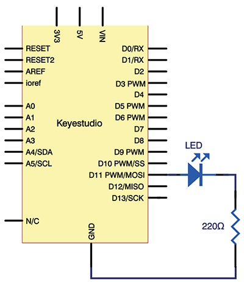

# プロジェクト3：呼吸するLED

## はじめに
最初の2つのプロジェクトを経て、Arduinoにある程度慣れてきたことと思います。このプロジェクトでは、LEDを使って別のことを行います。呼吸をシミュレートします。面白そうですね？では、始めましょう。プロジェクト2と同じハードウェアを使用します。

## 必要なハードウェア
* V4.0ボードまたはMEGA 2650ボード *1
* USBケーブル *1
* 赤色M5 LED *1
* 220Ω抵抗 *1
* ブレッドボード *1
* ブレッドボードジャンパーワイヤ *2

## 接続図

**V4.0の接続：**




<div class="page"/>

## サンプルコード

```cpp
int ledPin = 11;

void setup()
{
  pinMode(ledPin, OUTPUT);
}

void loop()
{
  // LEDを徐々に明るくする
  for (int a=0; a<=255; a++) 
  {
    analogWrite(ledPin, a); 
    delay(10);
  }

  // LEDを徐々に暗くする
  for (int a=255; a>=0; a--) 
  {
    analogWrite(ledPin, a); 
    delay(10);
  }
  delay(1000);
}
```

## テスト結果

LEDが徐々に明るくなり、0.01秒待機し、その後徐々に暗くなり、1秒待機します。そしてこのサイクルを繰り返し、まるでLEDが呼吸しているかのように見えます。